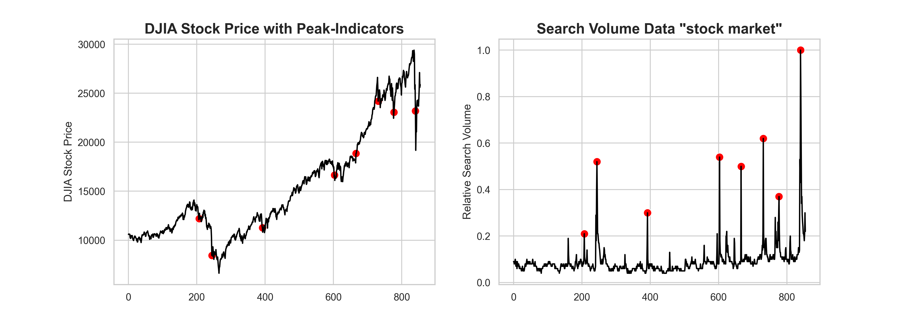
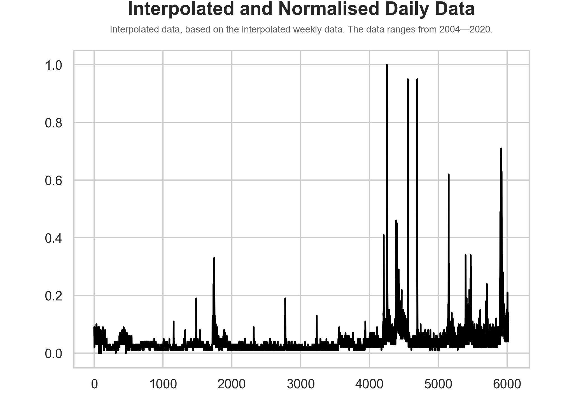
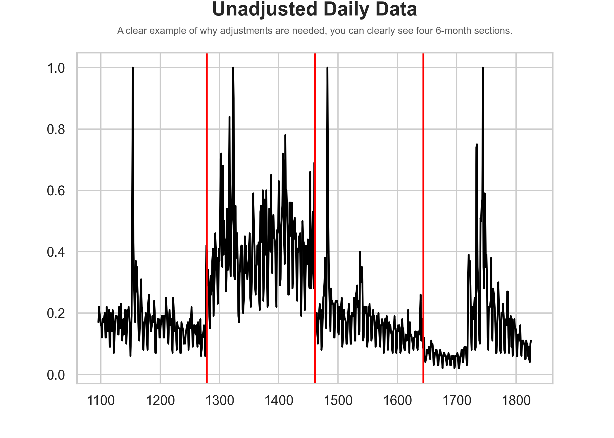
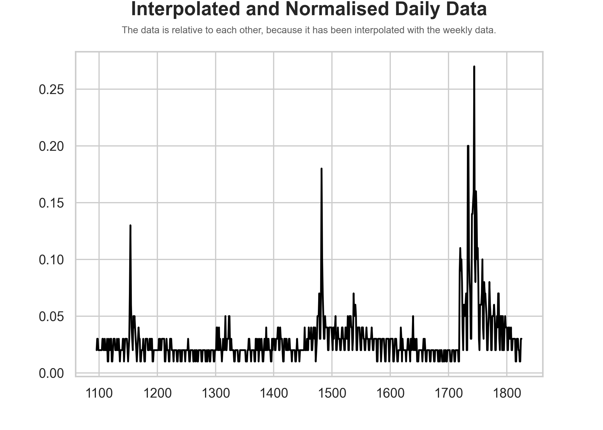
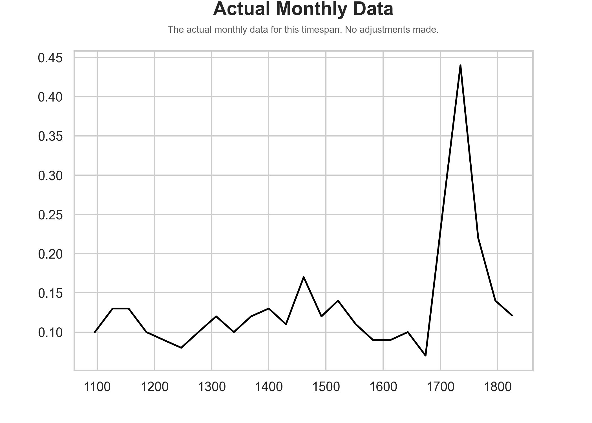

<p align="center">
  <a href="" rel="noopener">
 </a>
</p>

<h3 align="center">Njord</h3>

<div align="center">

  []() 
  [](/LICENSE)

</div>

---

<p align="center"> Njord attempts to predict future stock prices based on Google Trends data—using machine learning.
    <br> 
</p>

## Table of Contents
- [About](#about)
- [Project Status](#project_status)
- [Installation](#installation)
- [Reflection](#reflection)
- [Data](#data)
  - [Data Collection](#data_collection)
  - [Data Visualisation](#data_visualisation)
    - [Correlation](#correlation)
    - [Adjusted](#adjusted)
  - [Restrictions](#restrictions)
  - [Method](#method)
    - [Example](#example_merge)
      - [Before Adjustments](#before_adjustments)
      - [After Adjustments](#after_adjustments)
      - [Weekly](#weekly)
- [Project Organisation](#project_organisation)
- [License](#license)

## About <a name = "about"></a>

The data used by Njord is downloaded from [Google Trends](https://trends.google.com). The concept for this project came from research by Tobias Preis, Helen Susannah Moat, and H. Eugene Stanley, ["Quantifying Trading Behavior in Financial Markets Using _Google Trends_"](https://www.nature.com/articles/srep01684?__hstc=113740504.2a1e835c34ab7bf88e972fdd7a7debc8.1424476800061.1424476800062.1424476800063.1&__hssc=113740504.1.1424476800064&__hsfp=3972014050). In this research was found that the search volume for certain (financial) words are linked to the stock price of the Dow Jones Industrial Average stock price, and can in most cases predict a dip in the market. The purpose of this project is to combine this research with machine learning.

## Project Status <a name = "project_status"></a>

This project is currently under development.

## Installation <a name = "installation"></a>

> TODO

## Reflection <a name = "reflection"></a>

> TODO

## Data <a name = "data"></a>

### Data Collection <a name = "data_collection"></a>

Two datasets were needed for this project; the Google Trends daily data for a specific keyword and the stock price daily data for a specific ticker. To collect the Google Trends daily data, you have to download all 6-month increments, 5-year increments, and 2004—present within the 2004—2020 timespan. All this data will eventually be adjusted to be relative to each other, instead of only within its respective timespan. To collect the stock price daily data for a specific ticker you want to predict, you have to download it from a website like [Yahoo Finance](https://finance.yahoo.com), where you can download the historical data of any ticker.

### Data Visualisation <a name = "data_visualisation"></a>

#### Correlation <a name = "correlation"></a>
To prove that there indeed is a correlation between Google Trends data (e.g. 'debt') and stock prices (e.g. Dow Jones Industrial Average). I plotted the DJIA stock price with indicators of peaks in the search volume for "stock market". As you can see, before a major stock market crash, there are usually some peaks to be observed. There are also some peaks in the middle of a crash, but the peaks before the crash are quite indicative.

<p align="center">
  
  
  <b>Figure 1.</b> A graph where the stock price of DJIA is plotted with red dots where a peak in search volume for "stock market" has been observed. From this graph can be observed that erratic movement in search volume precedes a major stock crash.
</p>

#### Adjusted <a name = "adjusted"></a>

After all adjustments of the data to eventually get _relative_ daily data, which is relative to each other, the data visually looks as follows:

<p align="center">
  
  
  <b>Figure 2.</b> A graph in which the <i>adjusted</i> daily data is visualised.
</p>

### Restrictions <a name = "restrictions"></a>

All data on Google Trends is relative (0—100) to each other within one timeframe and you can only get daily data in 6-month increments, weekly data in 5-year increments, and only monthly data is provided for the entire timespan available. So to aggregate all data needed for this project was quite a challenge and because of these restrictions aren't completely accurate, however, the method I used was the only method to getting daily data over the entire timespan available (which is crucial for this project).

### Method <a name = "method"></a>

To get all the data relative to each other, instead of only within its 6-month increment, I had to merge them based on weekly data. However, the weekly data is only available in 5-year increments, so I had to merge these 5-year increments based on the monthly data, which is available for timespan needed for this project. To merge all the 6-month, and 5-year increments, I computed the percentage change of each data point within its respective increment. Afterwards, I got one data point from the higher up periodicity data per increment and computed the missing days by applying the percentage change to the provided data point.

#### Example <a name = "example_merge"></a>

An example of the search term 'debt' ('debt' is the best search term to predict market change, according to the research mentioned earlier) in the timespan 2007—2009:

#### Before adjustments <a name = "before_adjustments"></a>

<p align="center">
  
  
  <b>Figure 3.</b> A graph where the <i>unadjusted</i> relative daily data is visualised. The black vertical lines indicate the edges of the 6-month increments.
</p>

#### After adjustments <a name = "after_adjustments"></a>

<p align="center">
  
  
  <b>Figure 4.</b> A graph where the <i>adjusted</i> relative daily data is visualised. The graph follows the actual weekly data much better.
</p>

#### Weekly <a name = "weekly"></a>

<p align="center">
  
  
  <b>Figure 5.</b> The actual weekly data.
</p>

## Project Organisation <a name="project_organisation"></a>

```
    ├── LICENSE
    ├── Makefile           <- Makefile with commands like `make data` or `make train`
    ├── README.md          <- The top-level README for developers using this project.
    ├── data
    │   ├── external       <- Data from third party sources.
    │   ├── interim        <- Intermediate data that has been transformed.
    │   ├── processed      <- The final, canonical data sets for modeling.
    │   └── raw            <- The original, immutable data dump.
    │
    ├── docs               <- A default Sphinx project; see sphinx-doc.org for details
    │
    ├── models             <- Trained and serialized models, model predictions, or model summaries
    │
    ├── notebooks          <- Jupyter notebooks. Naming convention is a number (for ordering),
    │                         the creator's initials, and a short `-` delimited description, e.g.
    │                         `1.0-jqp-initial-data-exploration`.
    │
    ├── references         <- Data dictionaries, manuals, and all other explanatory materials.
    │
    ├── reports            <- Generated analysis as HTML, PDF, LaTeX, etc.
    │   └── figures        <- Generated graphics and figures to be used in reporting
    │
    ├── requirements.txt   <- The requirements file for reproducing the analysis environment, e.g.
    │                         generated with `pip freeze > requirements.txt`
    │
    ├── setup.py           <- makes project pip installable (pip install -e .) so src can be imported
    ├── src                <- Source code for use in this project.
    │   ├── __init__.py    <- Makes src a Python module
    │   │
    │   ├── data           <- Scripts to download or generate data
    │   │   └── make_dataset.py
    │   │
    │   ├── features       <- Scripts to turn raw data into features for modeling
    │   │   └── build_features.py
    │   │
    │   ├── models         <- Scripts to train models and then use trained models to make
    │   │   │                 predictions
    │   │   ├── predict_model.py
    │   │   └── train_model.py
    │   │
    │   └── visualization  <- Scripts to create exploratory and results oriented visualizations
    │       └── visualize.py
    │
    └── tox.ini            <- tox file with settings for running tox; see tox.readthedocs.io
```

## [License](/LICENSE) <a name = "license"></a>

MIT License

Copyright (c) 2020 Cristian Perez Jensen
