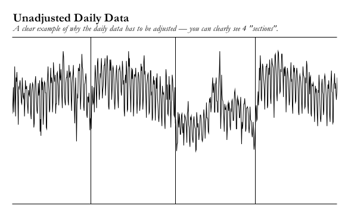
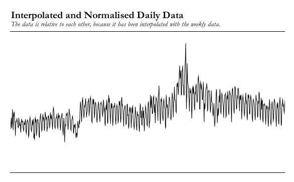
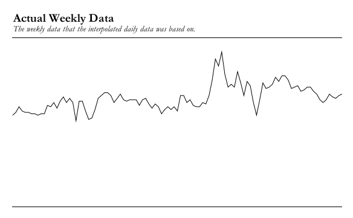

  

<h3 align="center">Njord</h3>

   
  

---

 Njord attempts to predict future stock prices based on Google Trends data - using a neural network.
      

## Table of Contents
- [About](#about)
- [Data](#data)
  - [Restrictions](#restrictions)
  - [The Merge](#the_merge)
    - [Example](#example_merge)

## About 

The data used by Njord is directly downloaded from [Google Trends](https://trends.google.com). The concept for this project came from this [research (PDF)](https://www.nature.com/articles/srep01684.pdf). In this research was found that the search volume for certain (financial) words are linked to the stock price of the Dow Jones Industrial Average stock price, and can in most cases predict a dip in the market. The purpose of this project is to combine this research with machine learning.

## Project Status

This project is currently under development. All data has been collected and cleaned for Njord's usage.

## Installation and Setup Instructions

> TODO

## Reflection

> TODO

## Data 

### Restrictions 

All data on Google Trends is relative to eachother within one timeframe (0-100), and you can only get daily data in 6-month increments, weekly data in 5-year increments, and only monthly data is provided for the entire timespan available. So to aggregate all data needed for this project was quite a challenge, and because of these restrictions aren't completely accurate, however the method I used was the only method to getting daily data over the entire timespan available (which was crucial for this project). However, I was determined to make it work.

### The Merge 

To get all the data relative to eachother, instead of only within it's 6-month increment. I had to merge them together based on weekly data. However, the weekly data is only available in 5-year increments, so I had to merge these 5-year increments together based on the monthly data, which is available for timespan needed for this project. To merge all the 6-month, and 5-year increments, I computed the percentage change of each data point within it's respective increment. Afterwards I got one data point (from the weekly data) per increment, and computed the missing days by applying the percentage change to the provided data point.

#### Example 

An example for the search term 'debt' - 'debt' is the best search term to predict market change - in the timespan 2007-2009:

Before adjustments:

  

  The black vertical lines indicate the edges of the 6-month increments.

After adjustments:

  

Weekly data points:

  

